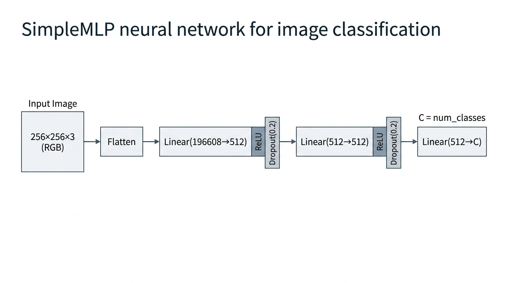

# MLP分類タスク

分類タスク用の簡易MLPモデルの学習スクリプトです。


## ファイル構成

- `train.py`: MLPモデルの学習スクリプト
- `configs/`: 設定ファイル（JSON）ディレクトリ

## 使用方法

設定ファイル（JSON）と `-o key=value` による上書きで学習します。

### 基本的な使用方法

```bash
python train.py [config.json] [-o KEY=VALUE ...]
```

config を省略した場合、`configs/default.json` が使用されます。

### 例

```bash
# デフォルト設定で学習
python train.py

# 設定ファイルを明示指定
python train.py configs/default.json

# data_root を上書き（リポジトリルート相対パスで指定）
python train.py -o data_root=data/touhoku

# 複数項目を上書き
python train.py configs/default.json \
    -o image_size=256 \
    -o batch_size=32 \
    -o epochs=20
```

### パス解決

`data_root` など config 内の**相対パス**は、**リポジトリルート**（zunda_ws/）を基準に解決されます。実行時のカレントディレクトリには依存しません。

- `data/touhoku_project_images` → `<リポジトリルート>/data/touhoku_project_images`
- 絶対パスを指定した場合はそのまま使用されます
- `work_dirs/1_mlp` など深いディレクトリから実行しても正しく動作します

### 設定ファイル

`configs/default.json` など JSON で設定を記述します。主な項目:


| 項目         | 説明                              | デフォルト |
| ----------- | --------------------------------- | ----- |
| data_root   | データセットのルートディレクトリ（必須） | -     |
| image_size  | 画像サイズ                          | 256   |
| batch_size  | バッチサイズ                        | 32    |
| epochs      | エポック数                          | 10    |
| lr          | 学習率                              | 0.001 |
| hidden_size | 隠れ層のサイズ                        | 512   |
| num_workers | DataLoader ワーカー数（共有メモリ不足時は 0 推奨） | 4     |
| use_wandb   | WANDB を使用する                      | true  |


## ログ機能

学習の進行状況は以下のように記録されます:

- **コンソール出力**: 標準出力にログが表示されます
- **ログファイル**: `logs/train_YYYYMMDD_HHMMSS.log` にタイムスタンプ付きで保存されます
- **WANDB**: 実験結果をWANDBに記録（デフォルトで有効）

ログには以下が含まれます:

- 学習設定（デバイス、バッチサイズ、エポック数など）
- 各エポックの学習/検証損失と精度
- ベストモデルの保存情報
- 学習完了後のサマリー（ベスト精度、テスト精度など）
- エラー発生時の詳細なスタックトレース

## WANDB統合

### セットアップ

1. **WANDBアカウントの作成**
  - [https://wandb.ai](https://wandb.ai) でアカウントを作成
2. **APIキーの取得**
  - WANDBの設定ページからAPIキーを取得
3. **APIキーの設定（推奨: `.wandb`ファイル）**
  **Docker環境とローカル環境の分離**
   Docker環境とローカル環境で**別々のWANDBアカウント/プロジェクト**を使用することを推奨します。
   自動的に環境を検出して、適切な設定ファイルを読み込みます。
   **ローカル環境用の設定**
   **Docker環境用の設定**
   ファイルの内容例:
   これらのファイルはプロジェクトルート（`/ws`）に配置してください。
   **環境の自動検出**
  - **ローカル環境**: `.wandb`ファイルを読み込み、`~/.config/wandb/`に設定を保存
  - **Docker環境**: `.wandb.docker`ファイルを読み込み、`~/.config/wandb_docker/`に設定を保存
   これにより、Docker環境とローカル環境で完全に分離されたWANDB設定が使用されます。
   **その他の方法**
   **方法2: 環境変数で設定**
   **方法3: コンテナ内でログイン**
   **優先順位**:
  1. 環境変数 `WANDB_API_KEY_FILE` で指定されたファイル
  2. Docker環境: `.wandb.docker` > 環境変数 `WANDB_API_KEY` > wandb login
  3. ローカル環境: `.wandb` > 環境変数 `WANDB_API_KEY` > wandb login

### 使用方法

```bash
# WANDBを使用して学習（デフォルト）
python train.py configs/default.json

# カスタムプロジェクト名とラン名を指定
python train.py configs/default.json \
    -o wandb_project=my-project \
    -o wandb_run_name=experiment-1 \
    -o wandb_tags=mlp,baseline

# WANDBを使用しない
python train.py configs/default.json -o use_wandb=false
```

### WANDBに記録される情報

- **ハイパーパラメータ**: 画像サイズ、バッチサイズ、学習率など
- **メトリクス**: 各エポックの学習/検証/テスト損失と精度
- **モデル構造**: MLPのアーキテクチャ
- **ベストモデル**: 検証精度が最も高いエポックの情報
- **チェックポイント**: ベストモデルのファイル（オプション）

## モデル構造

簡易的なMLPモデル:

- Flatten層
- Linear (入力 -> hidden_size) + ReLU + Dropout(0.2)
- Linear (hidden_size -> hidden_size) + ReLU + Dropout(0.2)
- Linear (hidden_size -> num_classes)

## 出力

### チェックポイント

- `checkpoints/best_model.pt`: 検証精度が最も高いモデル
- `checkpoints/final_model.pt`: 最終エポックのモデル

### ログファイル

- `logs/train_YYYYMMDD_HHMMSS.log`: 学習ログ（タイムスタンプ付き）

チェックポイントには以下が含まれます:

- `model_state_dict`: モデルの重み
- `optimizer_state_dict`: オプティマイザーの状態
- `class_to_idx`: クラス名からインデックスへのマッピング
- `idx_to_class`: インデックスからクラス名へのマッピング
- `val_acc`: 検証精度

## トラブルシューティング

### 共有メモリ（shm）エラー

Docker環境で`RuntimeError: DataLoader worker exited unexpectedly`や`Bus error`が発生する場合:

1. **docker-compose.ymlの共有メモリ設定を確認**
  - `shm_size: 64gb`が設定されています(64GB)。pcのスペックに合わせて調整してください
2. **ワーカー数を減らす**
  ```bash
   python train.py configs/default.json -o num_workers=0  # シングルプロセス
   # または
   python train.py configs/default.json -o num_workers=1  # ワーカー1つ
  ```
3. **Dockerコンテナを再起動**
  ```bash
   docker compose down
   docker compose up -d --build
  ```

### WANDBエラー

WANDBの認証エラーが発生する場合:

1. **環境を確認**
  ```bash
   # Docker環境かどうかを確認
   ls -la /.dockerenv  # Docker環境の場合のみ存在
   echo $DOCKER_CONTAINER  # docker-compose.ymlで設定
  ```
2. **適切な`.wandb`ファイルが存在するか確認**
  ```bash
   # ローカル環境用
   ls -la .wandb

   # Docker環境用
   ls -la .wandb.docker
  ```
3. `**.wandb`ファイルの内容を確認**
  ```bash
   # ローカル環境用
   cat .wandb

   # Docker環境用
   cat .wandb.docker
   # APIキーが正しく記述されているか確認
  ```
4. **WANDB設定ディレクトリを確認**
  ```bash
   # ローカル環境
   ls -la ~/.config/wandb/

   # Docker環境（コンテナ内で実行）
   ls -la ~/.config/wandb_docker/
  ```
5. **環境変数が設定されているか確認**
  ```bash
   echo $WANDB_API_KEY
  ```
6. **コンテナ内でログイン**
  ```bash
   docker compose exec zunda bash
   wandb login
  ```
7. **オフラインモードで実行**
  ```bash
   export WANDB_MODE=offline
   docker compose up -d --build
  ```
   または
