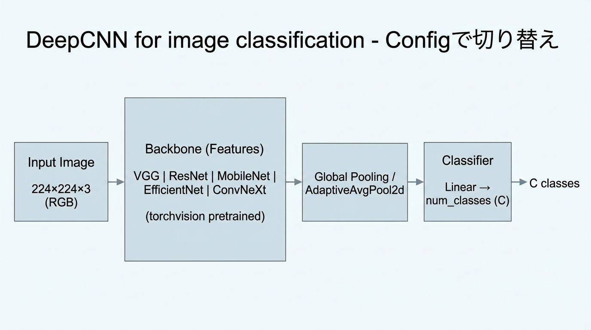
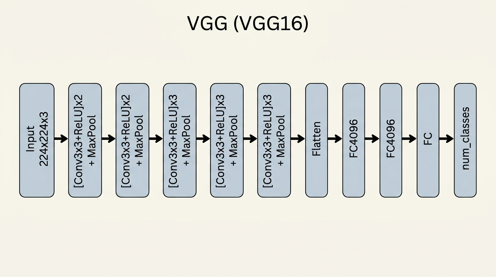
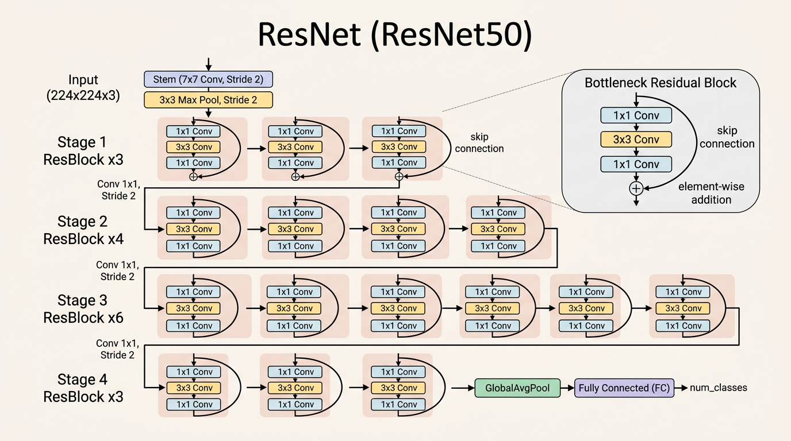
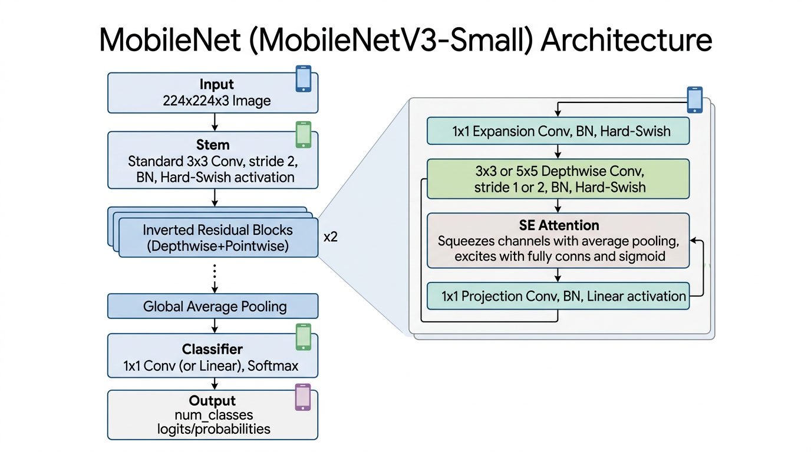
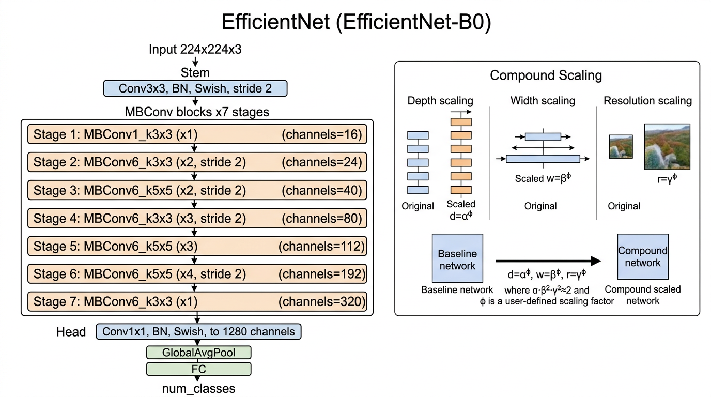
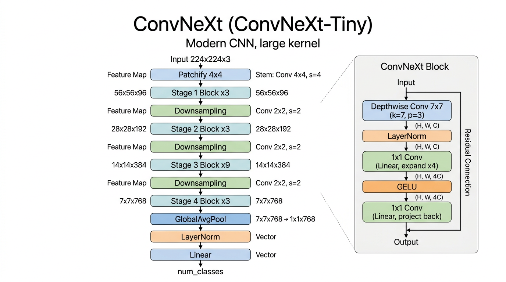

# DeepCNN分類タスク

分類タスク用の DeepCNN モデル（VGG/ResNet/MobileNet/EfficientNet/ConvNeXt）の学習スクリプトです。
Config でバックボーンを切り替えて利用します。



## モデル構造

- **入力**: 画像 (224×224×3、image_size で変更可)
- **Backbone**: torchvision モデル（Config で選択）
- **特徴抽出後**: Global Average Pooling
- **分類層**: Linear → num_classes（クラス数に応じて差し替え）

### 各アーキテクチャの構造

#### VGG (VGG16)
層の深い畳み込みブロック（3×3 Conv の積み重ね）。

- **設計思想**: 小さい 3×3 畳み込みを多段に重ねて受容野を拡大し、表現力を高める
- **特徴抽出**: `Conv-ReLU` を繰り返し、`MaxPool` で段階的に空間解像度を下げる
- **分類ヘッド**: 大きな全結合層（4096ユニット級）で最終分類するため、パラメータ数が多い
- **学習上の傾向**: モデル容量が大きく、データが少ないと過学習しやすい



#### ResNet (ResNet50)
残差接続（Skip Connection）を持つブロック。

- **設計思想**: `H(x)=F(x)+x` の残差学習で、深いネットワークでも勾配が流れやすい
- **ブロック構造**: ResNet50 は Bottleneck（1×1→3×3→1×1）を多段に積む
- **利点**: 学習安定性と精度のバランスが良く、転移学習のベースとして使いやすい
- **実運用の注意**: ステージ間でチャネル数が変わるため、下流層での feature 次元管理が重要



#### MobileNet (MobileNetV3-Small)
軽量・高速な Depthwise Separable Convolution と Inverted Residual。

- **設計思想**: 通常畳み込みを Depthwise + Pointwise に分解して計算量を削減
- **主要要素**:
  - **MBConv**: 拡張（1×1 Conv）→空間特徴計算（3×3 Depthwise Conv）→圧縮（1×1 Conv）を行う (Mobile Inverted Bottleneck Convolution)
  - **SE**: 各チャネルの平均値を見て、重要なチャネルの出力を強め、不要なチャネルを弱める (Squeeze-and-Excitation, SE）
- **利点**: パラメータ数・FLOPs が小さく、軽量環境（推論速度重視）に向く
- **学習上の傾向**: 軽量ゆえに表現力が限られるため、前処理と学習率設定の影響が出やすい



#### EfficientNet (EfficientNet-B0)
複合スケーリング（深さ・幅・解像度）による効率的な設計

- **設計思想**: MobileNet系と同じく MBConv + SE を使いながら、深さ・幅・入力解像度を同時にバランスよく拡張する compound scaling を導入
- **主要要素**: MBConv ブロックと SE（ブロック自体は MobileNet 系と類似）
- **利点**: 「どこだけを大きくするか」ではなく、モデル全体をバランス良く拡大するため、同じ計算量でも精度を上げやすい
- **実運用の注意**: 解像度やバッチサイズの変更でメモリ使用量と収束挙動が変わりやすい



#### ConvNeXt (ConvNeXt-Tiny)
モダンな CNN 設計（LayerNorm、大きなカーネル等）

- **設計思想**: CNN を Transformer 時代の設計に寄せて再構成した「モダンCNN」
- **主要要素**:
  - **Patchify stem**: 入力画像を最初に大きめのストライド付き畳み込みで分割し、トークンのような粗い特徴に変換する
  - **Large-kernel depthwise conv**: 各チャネルごとに大きなカーネルで畳み込み、広い範囲の文脈情報を低コストで取り込む
  - **LayerNorm**: バッチサイズに依存しにくい正規化で、学習を安定化しやすくする
  - **残差構造**: 入力をスキップ接続で足し戻し、深い層でも勾配を流しやすくして学習を安定させる
- **利点**: CNN の扱いやすさを維持しつつ、強い表現力を得やすい
- **学習上の傾向**: 最適化設定（lr, wd, augment）に敏感で、設定差が性能差になりやすい



## ファイル構成

- `3_deepcnn_architecture.png`: 全体モデル構造図
- `vgg_architecture.png`, `resnet_architecture.png`, `mobilenet_architecture.png`, `efficientnet_architecture.png`, `convnext_architecture.png`: 各アーキテクチャ構造図
- `train.py`: DeepCNNモデルの学習スクリプト
- `model.py`: モデル定義（各バックボーンのクラス定義 + torchvision モデル呼び出し）
- `inference.py`: 推論スクリプト
- `configs/`: 設定ファイル（JSON）ディレクトリ
  - `base.json` に共通設定を置き、`1_vgg.json` などで `_base_` 継承して差分を指定します。

## 使用方法

**config は必須**です。設定ファイル（JSON）と `-o key=value` による上書きで学習します。

### 基本的な使用方法

```bash
python train.py configs/<config名>.json [-o KEY=VALUE ...]
```

### 利用可能な Config

| Config | バックボーン | モデル |
|--------|-------------|--------|
| `configs/1_vgg.json` | VGG | vgg16 |
| `configs/2_resnet.json` | ResNet | resnet50 |
| `configs/3_mobilenet.json` | MobileNet | mobilenet_v3_small |
| `configs/4_efficientnet.json` | EfficientNet | efficientnet_b0 |
| `configs/5_convnext.json` | ConvNeXt | convnext_tiny |

### Config 継承（_base_）

`3_deepcnn` の config は MMEngine 風の `_base_` 継承に対応しています。
共通設定は `configs/base.json` に置き、各モデル config は差分のみを記述します。

```json
{
  "_base_": "base.json",
  "model_name": "vgg16",
  "wandb_tags": ["vgg16"]
}
```

### 例

```bash
# VGGで学習
python train.py configs/1_vgg.json

# ResNetで学習
python train.py configs/2_resnet.json

# MobileNetで学習
python train.py configs/3_mobilenet.json

# 上書き
python train.py configs/4_efficientnet.json \
    -o image_size=224 \
    -o batch_size=16 \
    -o epochs=50

# data_root を上書き
python train.py configs/5_convnext.json -o data_root=data/touhoku_project_images
```

### パス解決

`data_root` など config 内の**相対パス**は、**リポジトリルート**（zunda_ws/）を基準に解決されます。

### 設定ファイル

`configs/base.json` および `configs/1_vgg.json` などに JSON で設定を記述します。主な項目:

| 項目 | 説明 | 例 |
|------|------|-----|
| data_root | データセットのルートディレクトリ（必須） | data/touhoku_project_images |
| model_name | モデル名（必須） | vgg16, resnet50, mobilenet_v3_small, efficientnet_b0, convnext_tiny |
| image_size | 画像サイズ | 224（ImageNet系は224推奨） |
| batch_size | バッチサイズ | 32 |
| epochs | エポック数 | 100 |
| lr | 学習率 | 0.001 |
| pretrained | ImageNet事前学習済み重みを使うか | false |
| num_workers | DataLoader ワーカー数 | 4 |
| use_wandb | WANDB を使用する | true |

### 利用可能な model_name

- **VGG**: vgg11, vgg11_bn, vgg13, vgg13_bn, vgg16, vgg16_bn, vgg19, vgg19_bn
- **ResNet**: resnet18, resnet34, resnet50, resnet101, resnet152
- **MobileNet**: mobilenet_v2, mobilenet_v3_small, mobilenet_v3_large
- **EfficientNet**: efficientnet_b0 ～ efficientnet_b7
- **ConvNeXt**: convnext_tiny, convnext_small, convnext_base, convnext_large

`-o model_name=resnet18` などで上書き可能です。

## ログ機能

- **コンソール出力**: 標準出力にログが表示されます
- **ログファイル**: `outputs/YYYYMMDD_HHMMSS/train.log` にタイムスタンプ付きで保存されます
- **WANDB**: 実験結果をWANDBに記録（デフォルトで有効）

## 出力

### チェックポイント

- `outputs/YYYYMMDD_HHMMSS/checkpoints/best_model.pt`: 検証精度が最も高いモデル
- `outputs/YYYYMMDD_HHMMSS/checkpoints/final_model.pt`: 最終エポックのモデル

チェックポイントには `model_config`（model_name, pretrained, in_channels, image_size, num_classes）が含まれ、推論時に自動でモデルを再構築できます。

### 推論

```bash
python inference.py <checkpoint_path> <data_root>

# 例
python inference.py outputs/20240324_120000/checkpoints/best_model.pt data/touhoku_project_images
```

## トラブルシューティング

### 共有メモリ（shm）エラー

Docker環境で `RuntimeError: DataLoader worker exited unexpectedly` が発生する場合:

```bash
python train.py configs/1_vgg.json -o num_workers=0
```

### WANDBを使わない

```bash
python train.py configs/1_vgg.json -o use_wandb=false
```
