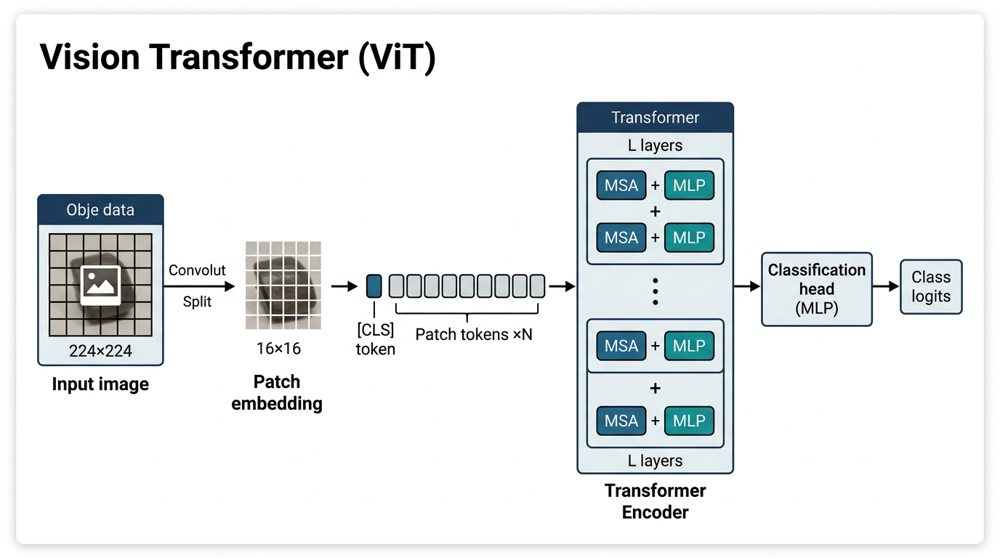

# ViT分類タスク

分類タスク用の Vision Transformer（ViT）学習スクリプトです（torchvision の pretrained モデルを利用）。

## アーキテクチャ

入力画像をパッチに分割して埋め込み、Transformer エンコーダで処理し、分類ヘッドでクラス logits を出力する流れの概略です（本プロジェクトは torchvision の ViT を利用）。



## ファイル構成

- `train.py`: ViTモデルの学習スクリプト
- `model.py`: ViTモデル生成（head差し替え等）
- `inference.py`: チェックポイントを使った推論スクリプト
- `configs/`: 設定ファイル（JSON）

## 使用方法

設定ファイル（JSON）と `-o key=value` による上書きで学習します。

### 基本的な使用方法

**config は必須**です。設定ファイル（JSON）と `-o key=value` による上書きで学習します。

```bash
python train.py configs/<config名>.json [-o KEY=VALUE ...]
```

### 例

```bash
# デフォルト相当（vit_b_16）
python train.py configs/default.json

# data_root を上書き（リポジトリルート相対パスで指定）
python train.py configs/default.json -o data_root=data/touhoku_project_images

# 複数項目を上書き
python train.py configs/default.json \
    -o model_name=vit_b_32 \
    -o image_size=224 \
    -o batch_size=16 \
    -o epochs=20
```

### パス解決

`data_root` など config 内の**相対パス**は、**リポジトリルート**（`zunda_ws/`）を基準に解決されます。

## 設定ファイル

`configs/base.json` および `configs/*.json` に JSON で設定を記述します。主な項目:

| 項目 | 説明 | デフォルト |
|------|------|-----------|
| data_root | データセットのルートディレクトリ | `data/touhoku_project_images` |
| model_name | ViT のモデル名 | `vit_b_16` |
| pretrained | ImageNet pretrained を使うか | `true` |
| image_size | 画像サイズ | `224` |
| batch_size | バッチサイズ | `32` |
| epochs | エポック数 | `10` |
| lr | 学習率 | `0.001` |
| use_class_weights | クラス重み付き損失を使うか | `false` |
| use_focal_loss | Focal Loss を使うか | `false` |
| num_workers | DataLoader ワーカー数 | `4` |
| use_wandb | WANDB を使うか | `false` |

## ログ機能

- **コンソール出力**: 標準出力にログが表示されます
- **ログファイル**: `outputs/YYYYMMDD_HHMMSS/train.log` に保存されます
- **WANDB**: `use_wandb=true` の場合のみ計測します（無効なら出力しません）

## 出力

学習の出力先（例）:

- `outputs/YYYYMMDD_HHMMSS/checkpoints/best_model.pt`: 検証精度が最も高いモデル
- `outputs/YYYYMMDD_HHMMSS/checkpoints/final_model.pt`: 最終エポックのモデル
- `outputs/YYYYMMDD_HHMMSS/results/`: 混同行列（best/final × train/val/test）などの成果物

## 推論

```bash
python inference.py <checkpoint_path> <data_root> \
  --results-dir ./results \
  --batch-size 32 \
  --num-workers 4
```

## トラブルシューティング

### 共有メモリ（shm）エラー

Docker 環境で `DataLoader worker exited unexpectedly` や `Bus error` が発生する場合:

1. **ワーカー数を減らす**
   ```bash
   python train.py -o num_workers=0
   ```

2. **Docker コンテナを再起動**
   ```bash
   docker compose down
   docker compose up -d --build
   ```

